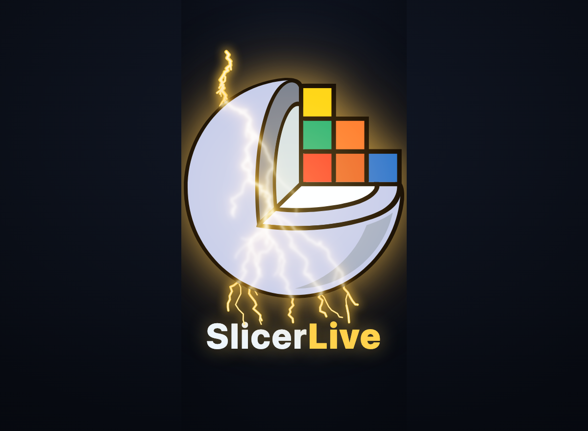

<p align="center">
  
</p>

# SlicerLive

**Live 3D Slicer scenes on the web** — open a URL and a Slicer MRML/MRB scene renders interactively in your
browser on your own GPU, with no Slicer install and no server for the common case. If a scene is too big for
the browser, the plan is one click to the native app or a cloud GPU (see `docs/SLICERLIVE.md`).

Built on the [desktopia](https://github.com/pieper/desktopia) offload displayable-manager stack (the JS DMs +
vtk.js render core). Gateway eventually at **live.slicer.org**.

## Try it

- **SEGRoulette** — spin a random AI / expert segmentation from the NCI <a href="https://imaging.datacommons.cancer.gov/" target="_blank" rel="noopener">Imaging Data Commons</a>
  (with its source CT, MR, or PET) into a live 3D + MPR viewer, no install, DICOM streamed from IDC's public buckets:
  <a href="https://pieper.github.io/live/viewer.html?segroulette" target="_blank" rel="noopener"><b>pieper.github.io/live/viewer.html?segroulette</b></a>
- **Colab notebook** — find an IDC segmentation with `idc-index` and view it in an embedded SlicerLive output cell:
  <a href="https://colab.research.google.com/github/pieper/SlicerLive/blob/main/notebooks/SlicerLive_IDC_demo.ipynb" target="_blank" rel="noopener"></a>
- **Gallery** of published scenes: <a href="https://pieper.github.io/live/" target="_blank" rel="noopener">pieper.github.io/live</a>
- **A specific IDC case** directly: `viewer.html?ct=<crdc_series_uuid>&seg=<crdc_series_uuid>&mod=CT` — the SEGRoulette
  **Details** popup has a *Copy link* button that builds one of these for the case you're viewing.

## Status — v0
`viewer/viewer.html?scene=<mrml-url>` loads a MRML scene from a URL and renders its **models** client-side via
vtk.js displayable managers — no server, no WebSocket. (Volumes, segmentations, markups, transforms, MRB, and
the adaptive browser-vs-cloud router are on the roadmap in `docs/SLICERLIVE.md`.)

## Run v0 locally
```bash
cd viewer && ./build.sh                              # bundles slicerlive.js -> slicerlive-bundle.js (uses docker)
python3 -m http.server 8096 --directory viewer
# open: http://localhost:8096/viewer.html?scene=testscene/scene.mrml
```

## Layout
- `viewer/` — the viewer client (`slicerlive.js`: DMs + vtk.js + the MRML/VTP loader) + `viewer.html` + `build.sh`.
- `viewer/testscene/` — a tiny demo scene (3 model spheres, `.vtp`).
- `docs/` — design notes: `SLICERLIVE.md` (architecture + roadmap), `WEB-VIEWER-VISION.md`,
  `MORPHODEPOT-JETSTREAM2.md`, `DISTRIBUTED-MRML-ARCHITECTURE.md`, `MRML-COUCH-DESIGN.md`.

## Model format note
Models load from **`.vtp`** (recommended — vtk.js reads it reliably; binary, compact geometry) or `.vtk`
**legacy 4.2 only**. vtk.js's `Legacy/PolyDataReader` does **not** parse the VTK-9 "DataFile Version 5.1"
cell format, so prefer `.vtp` when exporting from a recent Slicer.

> Build artifacts (`*-bundle.js`, `node_modules/`) are gitignored — run `viewer/build.sh` to regenerate.
