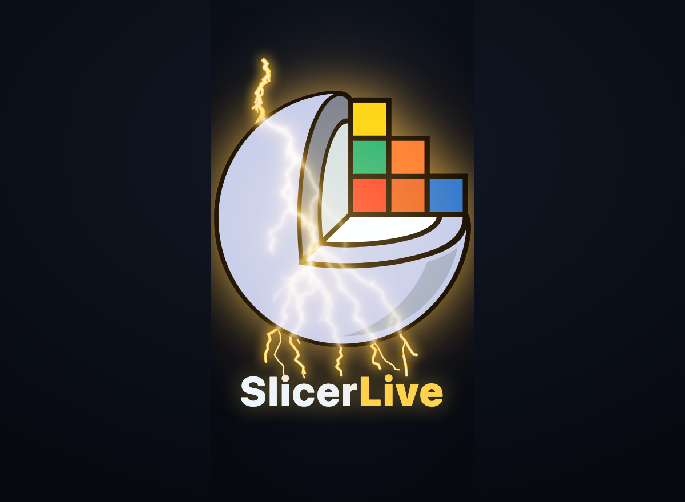

  

# SlicerLive

**Live 3D Slicer scenes on the web** — open a URL and a Slicer scene renders interactively in your browser
on your own GPU, with no Slicer install and no server for the common case. The same TypeScript/WebGPU
renderer also runs headless under Deno, so scenes too big for the browser can render on a remote GPU and
stream to thin clients. Gateway eventually at **live.slicer.org**.

> ⚠️ **Work in progress.** SlicerLive is an experimental platform under active development — and, quite
> deliberately, an experiment in AI-assisted coding: much of this code is written by AI agents working
> under human direction and review. Expect rough edges and rapid change.

## Try it

- **SEGRoulette** — spin a random AI / expert segmentation from the NCI <a href="https://imaging.datacommons.cancer.gov/" target="_blank" rel="noopener">Imaging Data Commons</a>
  (with its source CT, MR, or PET) into a live 3D + MPR viewer, DICOM streamed straight from IDC's public buckets:
  <a href="https://pieper.github.io/live/webgpu/segroulette.html" target="_blank" rel="noopener"><b>pieper.github.io/live/webgpu/segroulette.html</b></a>
- **Gallery** of live demos (volume rendering, 4-up MPR, segment editing, nnLive AI segmentation, LiveCodec, spine review):
  <a href="https://pieper.github.io/live/" target="_blank" rel="noopener">pieper.github.io/live</a>
- **Colab notebook** — find an IDC segmentation with `idc-index` and view it in an embedded SlicerLive output cell:
  

## Architecture

The one-line thesis: a **LiveScene** is a live, partially-replicated MRML scene — metadata (node state) plus
bulk data (content-addressed blobs) — that any number of **participants** observe and write back to over any
of several **transports**. Everything else in SlicerLive is either a participant or a transport. The current
canonical architecture note is
<a href="docs/ARCHITECTURE-2026-08-02.md" target="_blank" rel="noopener"><code>docs/ARCHITECTURE-2026-08-02.md</code></a>;
it links back through the earlier iterations it supersedes.

### The renderer

`render/` is a from-scratch TypeScript/WebGPU renderer with no scene-graph framework underneath. Its unit of
content is the **Field**: a WGSL-composable piece of renderable content that a `SceneRenderer` (3D) or
`SliceRenderer` (4-up MPR) ray-marches, compositing all fields in a single pass. The current fields:

- **`ImageField`** — a scalar image volume, direct volume rendering through a transfer function, with
  shading and cached empty-space skipping.
- **`RGBAVolumeField`** — a precolored RGBA volume, rendered directly (see colorize mode below).
- **`SegmentField`** — a segmentation rendered as a smooth shell or translucent surface (modes below).
- **`FiducialField`** — markup points as shaded, pickable spheres.
- **`CapsuleField`** — line and curve markups as capsule segments.
- **`RoiBoxField`** — an interactive ROI box with drag handles, whose planes crop any field marked clippable.
- **`TransformGizmoField`** — handles for grabbing and dragging transforms in the 3D view.
- **`TransformField`** — a modifier rather than a compositor: a displacement grid that warps another field's
  sampling position during the ray march.

**Transforms.** Linear (rigid/affine) transforms compose into each field's image-to-patient matrix, so a
transformed volume, segmentation, or markup costs nothing extra at render time. Nonlinear transforms — grid
and thin-plate-spline displacement fields — are `TransformField`s: a receiver field warps its sampling
position (including its gradient taps) through the displacement grid, so warps deform the apparent shape of
volumes and the positions of markups without the receiver knowing anything about the transform. Everything
runs in patient space, in millimeters, with slice orientations and display conventions matching Slicer's.

**Segmentation rendering** gets particular attention, with several modes for different uses:

- **Labelmap slices** — 2D slice views sample the labelmap with nearest-neighbor filtering for crisp,
  unsmoothed label boundaries, with per-label colors read straight from the label texture.
- **Iso shell** (the 3D default) — the binary labelmap is pre-smoothed by a small Gaussian and ray-marched
  as a crisp, opaque, sub-voxel anti-aliased shell at its mid-value isosurface. A pure ray-marched surface:
  no marching cubes, no polygons, so edits appear instantly.
- **Gradient-opacity surface** — a translucent mode where opacity follows the local gradient magnitude,
  giving the soft see-through look familiar from GPU volume-rendered segmentations.
- **RGBA colorize** — segmentation colors are baked together with the grayscale volume into a single RGBA
  volume (the "colorize volume" style) and rendered as one `RGBAVolumeField`, ideal for showing many labels
  in anatomical context.
- **SDF shells** — a signed-distance field is baked from the labelmap by a jump-flooding compute pass and
  rendered as a terrace-free crisp shell, with an optional per-voxel attribute texture giving each label its
  own opacity. An **adjacent-label interface mode** stores the unsigned distance to the nearest label
  *change* rather than to background, and re-derives surface normals locally — so tightly packed, touching,
  or nested labels (think vertebrae, or organs sharing walls) all surface cleanly from one multi-material
  field instead of one SDF per segment.

Performance work is measured, not guessed: GPU timestamp-query profiling and an ablation harness drive
optimizations like cached empty-space horizons (a representative scene went 236 ms → 27 ms with
byte-identical output); see
<a href="docs/RENDER-PERFORMANCE.md" target="_blank" rel="noopener"><code>docs/RENDER-PERFORMANCE.md</code></a>.

One codebase runs in the browser and headless under Deno — the remote path treats rendering as a
**Producer → sample stream → Reconstructor** pipeline steered by a frame-time **Budget**, so progressive
refinement locally and streamed rendering from a big remote GPU are the same mechanism
(<a href="docs/UNIFIED-RENDERING-PLAN.md" target="_blank" rel="noopener"><code>docs/UNIFIED-RENDERING-PLAN.md</code></a>).

### The scene model: observer-MVC, in Slicer's own terms

SlicerLive deliberately mirrors Slicer's MVC/observer shape, using Slicer's vocabulary:

- **LiveScene (the Model)** — the local authoritative copy of the scene, held as mrson nodes plus
  content-addressed blobs. It exposes `applyOp()`: apply a mutation and notify observers. Every write is
  tagged `{origin, version}`. This is the analogue of `vtkMRMLScene` and its node `ModifiedEvent`s.
- **DisplayableManagers (the View)** — keyed by node type, they observe the scene, rebuild GPU render
  objects (Fields) from node state, and request renders. Read-only, exactly like Slicer's
  `vtkMRMLAbstractDisplayableManager`.
- **Interactors and Controls (the Controller)** — the write half. An **Interactor** handles pointer input
  through a grab-or-bubble stack (camera at the root) and writes node state while holding an interaction
  lease; a **Control** is a data-bound DOM widget, the 1:1 DOM dual of a Slicer `qMRML` widget — it observes
  a node property and writes changes back. The event and multi-rate interaction model is specified in
  <a href="docs/ARCHITECTURE-2026-07-24.md" target="_blank" rel="noopener"><code>docs/ARCHITECTURE-2026-07-24.md</code></a>.

The invariant that keeps this honest: controllers never touch render objects or the network,
views never write, and sync never renders — all three coordinate only through LiveScene node state. That
means the same code runs standalone or connected: "connected" just adds a sync peer.

### LiveSync: replication, decoupled from everything else

The mental model is CouchDB-shaped — LiveScene is a local database, its observer dispatch is the changes
feed, and **LiveSync** is replication between two such databases (a browser LiveScene and a running Slicer,
or two LiveScenes). LiveSync is the only component that knows about the wire, so all the impedance matching
lives in one tunable place: latest-wins coalescing per key, debounce to the transport's sustainable rate,
echo suppression, update-on-complete for interactions that must not stream, and per-peer sequence
checkpoints so a reconnect catches up rather than re-snapshotting the scene. Bulk data rides a separate
content-addressed channel — the changes feed carries blob hashes, the bytes move lazily. The WebSocket is
the current transport; a shared-memory transport is planned for the bulk-data channel, so co-located
processes (Slicer and a local renderer, or renderer and compute) can pass volumes without copies. After any
burst, both sides converge on the same state. Divergence resolves by authority: a user-initiated change
beats any automated or echoed value
(<a href="docs/ARCHITECTURE-2026-08-02.md" target="_blank" rel="noopener"><code>docs/ARCHITECTURE-2026-08-02.md</code></a> §2–2a).

In practice this syncs bidirectionally with a running 3D Slicer over a WebSocket at ~1 ms per op — drag a
markup in the browser and it moves in Slicer, toggle visibility in Slicer's Qt GUI and the browser follows.

### mrson: the scene format

**mrson** is the document and operation format that LiveSync (and files, and recordings) carry —
LiveScene is the protocol, mrson is the payload, deliberately split so mrson can stand alone as a
vendor-neutral format. It is a schema'd JSON representation of a medical scene with two faces: a
materialized **document** (snapshot) and a stream of **ops** (incremental patches, Lamport-versioned,
drop-to-latest safe). Types are neutral nouns (`image`, `segmentation`, `markup`, `transform`, `mesh`,
`camera`…), not VTK class names; world space is patient space with explicit frames of reference; DICOM is
treated as a boundary — imported attributes are carried losslessly for round-trip, but never drive the
runtime. The full design, including how it subsumes OpenIGTLink-style realtime streams, is
<a href="docs/MRSON-LIVESCENE.md" target="_blank" rel="noopener"><code>docs/MRSON-LIVESCENE.md</code></a>;
scenes also support content-addressed commits and forks for Git-like history and sharing
(<a href="docs/MRSON-COMMITS-FORKS.md" target="_blank" rel="noopener"><code>docs/MRSON-COMMITS-FORKS.md</code></a>).

### Segment editing

`algorithms/` is a WebGPU-compute segment-editing engine — a sibling of `render/` with a strictly one-way
dependency (it imports the renderer's device and field plumbing; the renderer never imports it). An
`EditableSegmentation` keeps the labelmap in a GPU buffer that effects (paint, draw, islands, margin…)
mutate incrementally in compute shaders, with a live smooth-surface render mode so edits appear under the
brush in real time. It is driven entirely by mrson ops — no UI of its own — so the same edits can come from
a browser interactor, a replayed recording, or an AI agent; `logic/` glues the engines together. Design and
milestones: <a href="docs/ALGORITHMS.md" target="_blank" rel="noopener"><code>docs/ALGORITHMS.md</code></a>.

### The Slicer side: LiveStory

`LiveStory/` is the 3D Slicer module that makes Slicer a LiveScene peer. It exports a loaded scene to
mrson (a self-contained serializer, no Slicer core changes), hosts the Slicer-side LiveSync endpoint
(`mrson_live.py`: MRML observers out, `applyOps` in, with its own outbound coalescing), and records whole
sessions as keyframe + delta streams with real 4-up screenshots — a recorded session can be scrubbed and
replayed in the browser viewer. Narrated scene stories are served through Slicer's built-in WebServer.

### Testing: numbers, not screenshots

`harness/` drives identical synthetic input into native Slicer (via an MCP server) and the browser (via
Chrome DevTools Protocol) and compares **numbers** — camera parameters, slice offsets, voxel indices —
so look-and-feel parity with Slicer is a regression suite, not an eyeball judgment. Fixture-replay checks
run CI-style with neither Slicer nor a browser; see
<a href="docs/HARNESS.md" target="_blank" rel="noopener"><code>docs/HARNESS.md</code></a>.

## Background

SlicerLive continues a line of experiments in GPU-accelerated medical imaging:

- <a href="https://github.com/pieper/SlicerCL" target="_blank" rel="noopener"><b>SlicerCL</b></a> —
  3D Slicer extensions written in OpenCL through pyopencl, including a GPU-accelerated GrowCut effect for
  Slicer's segmentation editor. It contributed the core idea behind `algorithms/`: interactive segmentation
  editing expressed as GPU compute kernels, driven live from an editor UI.
- <a href="https://github.com/pieper/step" target="_blank" rel="noopener"><b>step</b></a> — GPU medical
  image computing in the browser with JavaScript and WebGL 2.0, working directly from DICOM-native data
  structures. It contributed the everything-in-the-browser premise, the patient/pixel/texture coordinate
  discipline and `aToB` naming conventions the renderer still uses, and the transform-composition pattern
  that `TransformField` follows today.

Beyond these direct ancestors, SlicerLive owes its deepest debt to the
<a href="https://www.slicer.org/" target="_blank" rel="noopener">3D Slicer</a> developers and users —
decades of their designs, code, and clinical-research workflows are the inspiration for, and the reference
implementation behind, essentially everything here — and to the many software developers and researchers
who published the algorithms and open implementations this project draws on, from ray-marched volume
rendering and jump-flooding distance transforms to the ecosystem of open DICOM tooling.

## Layout

- `render/` — the WebGPU renderer core, plus `render/demos/` (the pages published to the gallery) and
  `render/test/`.
- `algorithms/`, `logic/` — the segment-editing compute engine and the app-layer glue.
- `LiveStory/` — the 3D Slicer extension (export, live sync, session recording).
- `examples/` — larger scenario apps (spine review, LiveCodec).
- `harness/` — the Slicer ↔ SlicerLive A/B parity harness.
- `notebooks/` — the Colab IDC demo.
- `docs/` — design notes; start with
  <a href="docs/ARCHITECTURE-2026-08-02.md" target="_blank" rel="noopener"><code>docs/ARCHITECTURE-2026-08-02.md</code></a>,
  roadmap in <a href="docs/SLICERLIVE.md" target="_blank" rel="noopener"><code>docs/SLICERLIVE.md</code></a>.

## Acknowledgments

Thanks to **Andrey Fedorov** for his valuable testing and feedback, which shaped the SEGRoulette viewer
and its IDC integration.

This work is being developed under the NIH grant
<a href="https://reporter.nih.gov/search/NqGZkegLQkaxQEbLxCXMdw/project-details/11343589#description" target="_blank" rel="noopener"><b>R01 CA310962</b>,
<i>3D Slicer: A unified open-source platform for advanced cancer imaging research</i></a>.
